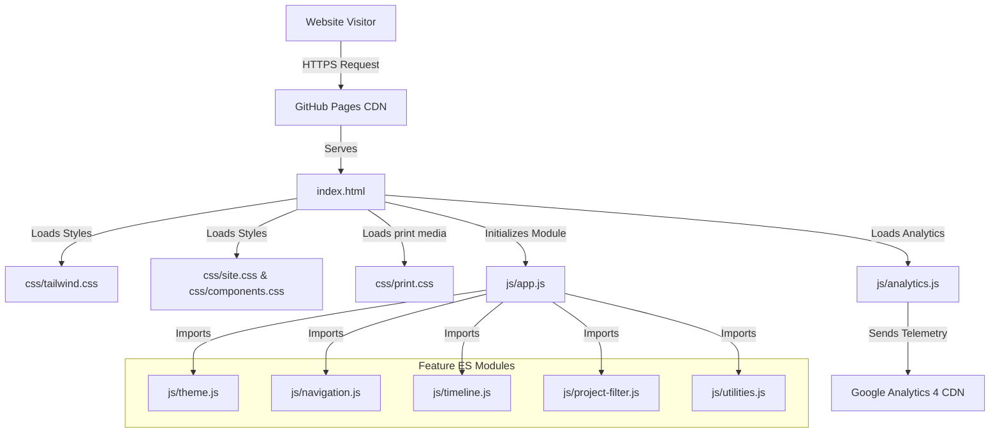

# Klao Thongchan Professional Showcase

An interactive, high-performance, single-page professional portfolio and curriculum vitae. Deployed from the repository root as a modern static application utilizing browser-native ES Modules and statically compiled Tailwind CSS.

[](https://pages.github.com/)
[](https://w3.org/TR/html5/)
[](https://tailwindcss.com/)
[](https://developer.mozilla.org/en-US/docs/Web/JavaScript/Guide/Modules)
[](https://analytics.google.com/)
[](LICENSE)

* **Live Production Website:** [https://klao-thongchan.github.io/](https://klao-thongchan.github.io/)
* **Staging / Test Environment:** [https://klao-thongchan.github.io/test/](https://klao-thongchan.github.io/test/)
* **GitHub Repository:** [https://github.com/klao-thongchan/klao-thongchan.github.io](https://github.com/klao-thongchan/klao-thongchan.github.io)
* **Release Version:** `v1.0.3` (Documentation Release)
* **Deployment Target:** GitHub Pages

---

## B. Project Overview

This website serves as the professional showcase and interactive curriculum vitae of **Thongchan Thananate (Klao)**. It highlights executive leadership and research expertise in Applied AI, Agentic Workflows, Product Strategy, Behavioral Economics, Game Publishing, and Deep-Tech Adoption.

### Key User-Facing Sections
* **Hero & Professional Positioning:** A high-impact introduction summarizing capabilities in bridging human behavioral psychology with complex software systems.
* **Interactive Experience Timeline:** A chronological accordion-style log of executive roles with detailed breakdowns of key metrics and achievements.
* **Certifications Showcase:** A grid displaying verified industry and academic credentials.
* **Skills & Technical Capabilities:** Organized capability categories displaying competencies in Product Strategy, Applied AI engineering, and technical leadership.
* **Case Studies & Projects:** A filterable catalog of real-world rescues, GTM strategy implementations, and technical systems launches.
* **Alliances & Integrations:** Interactive log of partnerships with major platforms (Garena, LINE, AIS, True, Bangkok Airways, Krungthai Bank).
* **Direct Contact Channels:** Strategic engagement links and action prompts.
* **Theme Controller:** A manual light/dark toggle persisted across visits via browser storage.
* **Responsive Navigation:** A dynamic header with a slide-out drawer optimized for touch-based mobile viewports.

---

## C. Architecture Overview

The frontend architecture is designed to be lean, secure, and fast. It functions as a **static-site application** served directly by the GitHub Pages CDN. 

### Core Architectural Decisions
* **No Runtime Framework:** Built using vanilla HTML5 and modular JavaScript. Eliminating frameworks like React or Vue prevents bundle bloat, ensures instant loading times, and removes hydration delays.
* **Browser-Native ES Modules:** Frontend logic is partitioned into clean, single-responsibility files imported natively by the browser.
* **Statically Compiled Tailwind CSS:** Tailwind utility classes are pre-compiled and committed directly. The browser parses a single cached stylesheet rather than compiling styles on the fly via heavy runtime scripts.
* **Decoupled Telemetry:** Google Analytics 4 is integrated via an isolated custom wrapper (`js/analytics.js`) that uses event delegation to capture page interactions without polluting core UI logic.
* **Staging vs Production Environments:** The repository includes a `/test` subdirectory containing an identical, isolated layout for staging and security audits.

### Mermaid System Architecture



---

## D. Technology Stack

| Layer | Technology | Purpose | Relevant Files |
| --- | --- | --- | --- |
| **Structure** | HTML5 | Semantic document structure & accessibility landmarks. | `index.html`, `test/index.html` |
| **Styling** | Tailwind CSS | Utility-first responsive styling framework (compiled). | `css/tailwind.css`, `test/css/tailwind.css` |
| **Styling** | Custom CSS | Document background styling & CSS variables. | `css/site.css` |
| **Styling** | Component CSS | Glassmorphism card effects, scrollbars, and focus rings. | `css/components.css` |
| **Styling** | Print CSS | High-fidelity black-and-white page formatting for print outputs. | `css/print.css` |
| **Orchestrator** | JavaScript ES Modules | Dynamic module loading, orchestration, and bootstrap lifecycle. | `js/app.js`, `test/js/app.js` |
| **Analytics** | Google Analytics 4 | Event tracking, visibility tracking, and user telemetry. | `js/analytics.js`, `test/js/analytics.js` |
| **Icons** | Font Awesome CDN | Scalable vector graphic iconography. | Remote CDN reference in `<head>` |
| **Validation** | Node.js scripts | Checks production/staging resources, security requirements, and ES-module imports. | `verify_prod.js`, `test/verify.js` |
| **Deployment** | GitHub Pages | Publishes committed static assets; `.nojekyll` prevents template processing. | `.nojekyll` |
| **Legacy Content** | Jekyll source | Preserves historical posts and layouts but is not required by the modern portfolio. | `_config.yml`, `Gemfile`, `_includes/`, `_layouts/`, `_posts/` |

### Verified Browser API Dependencies
* **`IntersectionObserver`:** Powers the Scroll Spy active navigation highlights and the delayed Google Analytics section-view telemetry.
* **`localStorage`:** Persists the user's manual theme selection (light or dark mode) across browser sessions.
* **DOM Event Delegation:** Listens globally on the document root for telemetry clicks, reducing event listener memory footprints.
* **`URL` & `Set` & `Map`:** Used to parse referrers, track unique viewport elements, and filter dynamic project collections.

---

## E. Frontend Application Architecture

The client-side JavaScript follows a strictly modular design. The entrypoint `js/app.js` acts as an orchestrator, bootstrapping components on `DOMContentLoaded`.

### Initialization Sequence
1. **Theme Setup:** `initTheme()` immediately detects system or stored user preferences to block Flash of Inaccurate Theme (FOIT).
2. **Mobile Drawer:** `initMobileMenu()` registers keyboard event listeners (Escape) and click triggers to operate the hamburger navigation drawer.
3. **Timeline Accordions:** `initTimelineAccordion()` maps expansion triggers, updates chevron vectors, and maintains ARIA accessibility properties.
4. **Project Filters:** `initProjectFiltering()` scans metadata categories and hides card structures not matching the active filter.
5. **Scroll Spy:** `initScrollSpy()` observes section visibilities via `IntersectionObserver` to highlight navigation links.
6. **Utilities & Versioning:** Renders the dynamic copyright year and appends the single-source-of-truth build identifier (`js/version-meta.js`) to the page footer.

### Module Breakdown

| Module | Responsibility | Important DOM / API Dependencies |
| --- | --- | --- |
| [app.js](js/app.js) | Application entrypoint. Safe execution wrappers prevent one module's crash from blocking others. | `document.addEventListener('DOMContentLoaded')` |
| [theme.js](js/theme.js) | Light/dark mode execution. Toggles `.dark` on `<html>`. | `localStorage`, `window.matchMedia` |
| [navigation.js](js/navigation.js) | Hamburger menu toggle drawer & scroll tracking. | `#mobile-menu`, `.nav-link`, `IntersectionObserver` |
| [timeline.js](js/timeline.js) | Timeline card accordion. Switches attributes and button text. | `.timeline-toggle`, `.timeline-details`, `aria-expanded` |
| [project-filter.js](js/project-filter.js) | Multi-category card search. Shows/hides project containers. | `.filter-btn`, `.project-card`, `data-category`, `aria-pressed` |
| [utilities.js](js/utilities.js) | Renders copyright year and outputs build-metadata footer text. | `#current-year`, `document.body.appendChild` |
| [version-meta.js](js/version-meta.js) | *Auto-generated* build metadata (Version, Date, Git SHA, Environment). | Loaded by `utilities.js` |

---

## F. Styling System

Styles are structured hierarchically to balance clean responsive grids with high-fidelity visual elements.

### Styling Architecture
1. **Utility Layer (`css/tailwind.css`):** Formulates the baseline grid layout, spacing utilities, dark-mode styling blocks, and typography defaults.
2. **Base Theme Layer (`css/site.css`):** Sets deep-background rendering (decorative backdrop glow-blobs), scrollbar visual behaviors, and default selection background colors.
3. **Component Layer (`css/components.css`):** Implements CSS variables, glassmorphism templates (`glass-card`, `glass-nav`), border animations, and keyboard focus indicators.
4. **Print Formatting (`css/print.css`):** Media query rules (`@media print`) that restyle the portfolio into a print-friendly document. It strips color gradients, hides dynamic navigation bars, disables theme toggles, expands all accordion details automatically, and formats sections for standard paper sizes.

### Design Tokens
* **Typography:** `Inter` (sans-serif) for content readability, `Outfit` (sans-serif) for high-impact display headings.
* **Responsive Breakpoints:** Optimized for mobile (default), tablet (`md: 768px`), and desktop (`lg: 1024px`) viewports.
* **Dark Mode:** Governed via the class selector `dark` set on the root element.

---

## G. Analytics and Measurement Architecture

The telemetry script (`js/analytics.js`) is custom-engineered to capture deep visitor engagement metrics while enforcing strict user-privacy safeguards.

### Analytics Mechanisms
* **Declarative HTML Instrumentation:** Page interactions are captured without hardcoding tracking statements inside scripts. Elements define `data-analytics-event="event_name"` and custom variables via `data-analytics-param-[name]="value"`.
* **Central Event Delegation:** A single, passive click listener sits on the document root, parsing analytics attributes when targets are clicked. This keeps the browser memory footprint low.
* **Dynamic Section-View Telemetry:** Portfolio sections (containing `data-analytics-section`) are observed using `IntersectionObserver`. A `section_view` event fires once a section is at least 50% visible in the viewport for 1 full second (preventing false positives from rapid scrolling).
* **Staging Segmentation:** If pages are loaded under the `/test` path, the script injects `environment: "test"` and `debug_mode: true` parameters into GA4, while outputting full payload logs to the browser console.

### Privacy Safeguards
* **PII Redaction:** Strings matching email syntaxes or telephone layouts are automatically scrubbed and replaced with `[REDACTED_EMAIL]` and `[REDACTED_PHONE]` prior to dispatch.
* **URL Sanitization:** Query parameters (often containing referral tokens or private tracking keys) are stripped from page paths and location fields.
* **Parameter Flattening:** Prevents nested arrays or objects in the telemetry payload to comply with GA4 validation rules.
* **Event Validation:** Rejects any events not using lowercase snake_case naming structures.
* **Graceful Degradation:** Operations execute within `try-catch` scopes and verify Google's `gtag` API presence, ensuring the page remains functional if tracking scripts are blocked.

---

## H. Security Model

Security is managed via client-side controls that minimize the attack surface of the static landing page.

### Client-Side Security Controls
* **Content Security Policy (CSP):** Delivered via a `<meta http-equiv="Content-Security-Policy">` tag. It enforces strict script-loading boundaries:
  ```text
  default-src 'self';
  script-src 'self' https://www.googletagmanager.com;
  style-src 'self' https://fonts.googleapis.com https://cdnjs.cloudflare.com;
  img-src 'self' data: https://www.google-analytics.com https://www.googletagmanager.com;
  font-src 'self' https://fonts.gstatic.com https://cdnjs.cloudflare.com;
  connect-src 'self' https://*.google-analytics.com https://www.google-analytics.com;
  form-action 'none';
  frame-src 'none';
  worker-src 'self';
  upgrade-insecure-requests;
  ```
* **Referrer Policy:** Configured to `strict-origin-when-cross-origin` to prevent sending path metadata to external links.
* **External Link Isolation:** All anchor tags pointing to external websites enforce `target="_blank" rel="noopener noreferrer"` to eliminate tabnabbing risks.
* **Audited Codebase:** The build pipeline runs strict validation tests (`verify_prod.js` and `test/verify.js`) to reject inline scripts, dangerous protocols (`javascript:`), or unstyled tags.

### Architectural Limitations
* **Static Site Limits:** Because the site is served via standard GitHub Pages, CSP headers cannot be configured at the HTTP server level. The meta tag implementation does not support features like `report-to` directives or frame-ancestors restrictions.
* **No Server-Side Auth:** The app has no backend database. No API keys, credentials, or administrative mechanisms are present.

---

## I. Accessibility

The showcase complies with modern accessibility best practices to ensure it remains readable and navigable for users with assistive devices.

* **Semantic HTML Landmarks:** Navigable structures are explicitly mapped using `<header>`, `<main>`, `<section>`, `<nav>`, and `<footer>` tags.
* **ARIA States Integration:** Interactive controls maintain clear structural associations:
  * Mobile menus use `aria-controls="mobile-menu"` and toggle `aria-expanded` state.
  * Timeline buttons use `aria-controls` to reference accordion panels and toggle `aria-expanded` states.
  * Project filter controls update `aria-pressed="true|false"` when toggled.
* **Keyboard Navigation:** Custom focus rings (`focus-visible:ring-2`) styling provides strong visual indicators for keyboard tab navigation.
* **Escape Hook:** The mobile navigation drawer can be closed immediately from anywhere on the screen by pressing the `Escape` key.
* **High Contrast & Font Readability:** Text sizes, weights, and color pairings are calculated to satisfy color contrast targets, supporting seamless toggling between light and dark themes.

---

## J. Responsive and Cross-Platform Behavior

The frontend is fully optimized to deliver a responsive, layout-accurate experience across standard screen categories:

* **Fluid Grids:** Grid containers adapt dynamically from 1 column on mobile to 2 columns on tablet, and up to 3 columns on widescreen monitors.
* **Touch-Friendly Controls:** Menu buttons, toggles, and interactive links are sized to exceed minimum tap target dimensions (48x48px) to accommodate mobile screen usage.
* **No Framework Hydration:** Utilizing vanilla JavaScript ensures that the website requires zero CPU compilation or hydration phases on mobile devices, achieving near-instant Time to Interactive (TTI) scores.

---

## K. SEO and Social Metadata

Search Engine Optimization is configured to guarantee indexing visibility and rich rendering across social platforms.

* **Document Hierarchy:** Enforces a single `<h1>` tag at the document root, with sequential subsections mapped cleanly through `<h2>` and `<h3>` tags.
* **Metadata Tags:** Features a descriptive, keyword-optimized page title, author attributes, and custom descriptions in the document head.
* **Open Graph Protocol:** Fully populated social metadata (including `og:title`, `og:description`, `og:type`, and `og:url`) to format presentation cards when shared on Slack, LinkedIn, or Twitter.
* **Canonical URL Rules:** Points to `https://klao-thongchan.github.io/` to prevent duplicate index results across staging environments.
* **Static Sitemap:** `sitemap.xml` lists the production homepage and CV route; staging is intentionally excluded.

---

## L. Repository Structure

```text
.
├── index.html                      # Primary landing page document (Production)
├── 404.html                        # Static GitHub Pages error document
├── sitemap.xml                     # Static production sitemap
├── robots.txt                      # Crawler rules; excludes staging
├── version.json                    # Single-source-of-truth version config
├── verify_prod.js                  # Production environment audit script
├── css/                            # Active Stylesheets (Production)
│   ├── tailwind.css                # Compiled Tailwind utilities
│   ├── site.css                    # Main background & scrollbar settings
│   ├── components.css              # Custom layout components (glass cards)
│   └── print.css                   # Print stylesheet formatting rules
├── js/                             # Active JavaScript Modules (Production)
│   ├── app.js                      # Main orchestrator & entrypoint
│   ├── analytics.js                # Custom GA4 tracking & privacy wrapper
│   ├── theme.js                    # Light/dark theme toggle module
│   ├── navigation.js               # Drawer menu & scroll-spy observer
│   ├── timeline.js                 # Experience details accordion
│   ├── project-filter.js           # Project portfolio sorting logic
│   ├── utilities.js                # Copyright and dynamic version injector
│   └── version-meta.js             # Auto-generated version metadata
├── cv/                             # Isolated CV HTML page (Active)
│   ├── index.html
│   ├── css/
│   │   └── cv.css
│   └── js/
│       └── cv.js
├── test/                           # Staging / Test Environment (Active)
│   ├── index.html                  # Isolated test document
│   ├── verify.js                   # Staging security audit script
│   ├── tailwind.config.js          # Staging Tailwind configuration
│   ├── css/
│   │   ├── tailwind-input.css      # Tailwind compilation source
│   │   └── tailwind.css            # Compiled test stylesheet
│   └── js/                         # Isolated test ES modules
│       ├── app.js
│       ├── analytics.js
│       ├── theme.js
│       ├── navigation.js
│       ├── timeline.js
│       ├── project-filter.js
│       ├── utilities.js
│       └── version-meta.js
├── scripts/                        # Automation & Build Scripts (Tooling)
│   └── generate-version.js         # Build script compiling version-meta.js
├── assets/                         # Shared favicon and historical blog assets
│   └── img/
├── _config.yml                     # Jekyll configuration (Legacy/Theme)
├── Gemfile                         # Jekyll dependency list (Legacy/Theme)
└── README.md                       # Repository documentation (This file)
```

---

## M. Local Development

To ensure ES Modules load correctly without triggering CORS errors, the website should be served via a local HTTP server rather than opening file paths directly in a browser.

### Recommended Current Workflow
1. **Clone the repository:**
   ```bash
   git clone https://github.com/klao-thongchan/klao-thongchan.github.io.git
   cd klao-thongchan.github.io
   ```
2. **Launch a local server:**
   * Using Python 3:
     ```bash
     python3 -m http.server 8000
     ```
   * Using Node.js (npx):
     ```bash
     npx -y http-server -p 8000
     ```
3. **Open in browser:**
   Go to [http://localhost:8000](http://localhost:8000) for production or [http://localhost:8000/test/](http://localhost:8000/test/) for staging.

### Version Compilation
When modifying the release version, update the string inside `version.json` and generate the updated modules:
```bash
node scripts/generate-version.js
```
This updates the build date, Git commit hash, and version parameters in `js/version-meta.js` and `test/js/version-meta.js`.

---

## N. Deployment

The live site currently publishes the committed static files from `main`. The `.nojekyll` marker prevents GitHub Pages from interpreting historical Liquid/Jekyll sources.

Before pushing a release:

1. Run `node scripts/generate-version.js` when the release version changes.
2. Run `node verify_prod.js` and `node test/verify.js`.
3. Review the diff and push to `main` through the normal repository workflow.
4. Confirm the GitHub Pages deployment succeeds and check `/`, `/cv/`, `/test/`, `/404.html`, and `/sitemap.xml`.

The repository still contains `.github/workflows/pages.yml`, a legacy Jekyll deployment workflow. Its current status and the repository's Pages source setting should be confirmed before the workflow is repaired or removed.

---

## O. Development and Maintenance Guidelines

Future developers maintaining or extending the portfolio site should adhere to the following conventions:

* **Modifying Content:** Updates to text copy, timeline listings, or case cards should be modified directly in the respective target HTML layouts (`index.html` and `test/index.html`). Keep selectors and class listings synchronized.
* **Adding Analytics Triggers:** Add data attributes directly to the HTML markup:
  ```html
  <button data-analytics-event="cta_click" data-analytics-param-label="Join Newsletter">
    Join
  </button>
  ```
  Do not write inline `<script>` tags, as they will be blocked by the Content Security Policy (CSP).
* **Extending CSS:** Avoid writing style blocks inside components. Custom style parameters belong in `css/site.css` or `css/components.css`. Use CSS custom properties (variables) to maintain color or typography consistency.
* **Javascript Modules:** Preserve the ES Module imports inside `js/app.js`. If you add new feature scripts, encapsulate the functions, export them, and import them inside `js/app.js` using a defensive `try-catch` wrapper.
* **Pre-Deployment Audits:** Prior to staging deployments, run the verification scripts locally to ensure no style regressions or security policy violations exist.

---

## P. Validation Checklist

Before pushing changes to production, execute the following manual and programmatic verification checks:

- [ ] Programmatic check `node verify_prod.js` passes with zero errors.
- [ ] Programmatic check `node test/verify.js` passes with zero errors.
- [ ] Local server initializes and hosts page content correctly.
- [ ] Developer console shows zero resource load errors, JS exceptions, or CSP blocking violations.
- [ ] Mobile navigation drawer operates cleanly and closes on pressing `Escape`.
- [ ] Dark/Light mode theme toggle updates settings instantly and persists choice on reload.
- [ ] Experience accordion panels expand and collapse, changing chevron arrows and text content.
- [ ] Portfolio filter selectors dynamically show and hide case cards.
- [ ] External links open in new tabs and contain `rel="noopener noreferrer"`.
- [ ] Telemetry events output correctly in the console under the `/test` staging path.
- [ ] Print stylesheets generate high-quality black-and-white print layouts on page preview (`Cmd+P`).

---

## Version History

### v1.0.3 — Technical Documentation Release
**Release Date:** 18 July 2026

#### Added
- Complete project-specific technical documentation replacement for `README.md`.
- Architecture overview and Mermaid systems interaction diagram.
- Active technology-stack specifications and source file mappings.
- ES-module frontend architecture layout.
- Detailed Google Analytics 4 tracking specifications and privacy safeguards.
- CSP constraints and security model configurations.
- Directory tree mapping active, generated, and legacy components.
- Local development workflow documentation and verification checklist.

#### Fixed
- Restored missing `css/tailwind.css` to the production environment directory.
- Integrated `css/tailwind.css` verification checks inside `verify_prod.js`.

#### Changed
- Replaced the inherited Adam Blog theme README.
- Incremented release version across production and test environments to `1.0.3`.

---

### v1.0.2 — Version & Text Sync
**Release Date:** 18 July 2026

#### Added
- Added custom dynamic version metadata indicators in footers.
- Version generator build script `scripts/generate-version.js`.

#### Changed
- Incremented site release version to `1.0.2`.

---

### v1.0.1 — Security and Layout Hardening
**Release Date:** 18 July 2026

#### Added
- Integrated strict Content Security Policy (CSP) headers.
- Implemented Referrer-Policy configurations.
- Audited external links for `noopener noreferrer` tags.
- Programmatic staging security checking script `test/verify.js`.

---

## R. Attribution and Licensing

* **License:** The portfolio content and custom source code are licensed under the [GNU General Public License v3.0](LICENSE).
* **Attribution:** This codebase was historically derived from the [Adam Blog 2.0 Jekyll Theme](https://github.com/the-mvm/the-mvm.github.io) by Armando Maynez, based on [Adam Blog 1.0](https://github.com/artemsheludko/adam-blog) by Artem Sheludko. Legacy layout components are preserved in compliance with original theme licensing terms.
